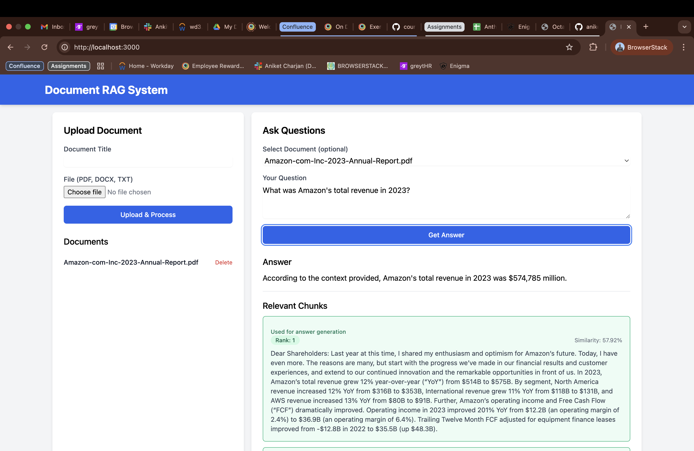

# RAG-Document-Questioning

This project is a **Retrieval-Augmented Generation (RAG) system** designed to answer questions based on the contents of uploaded documents. It utilizes **PostgreSQL with the `pgvector` extension** for vector similarity search and integrates with the **Anthropic Claude API** for generating responses.

---

## 🛠 Features

✅ Upload and process documents (PDF, DOCX, TXT, MD)  
✅ Store document chunks with embeddings in PostgreSQL  
✅ Query documents and get answers based on the content  
✅ Re-rank document chunks based on various factors  
✅ Generate answers using the **Anthropic Claude API**  

---

## 📂 Project Structure

```
RAG-DOCUMENT-QUESTIONING
│── node_modules/
│── public/
│── routes/
│── services/
│   ├── documentService.js
│   ├── ragService.js
│── uploads/
│   ├── <uploaded-files>
│── .env
│── .gitignore
│── app.js
│── db.js
│── LICENSE
│── package.json
│── package-lock.json
│── README.md
```

---

## 🚀 Getting Started

### ✅ Prerequisites

- **Node.js** (Latest Stable Version)
- **PostgreSQL** with `pgvector` extension
- **Anthropic API Key**
- **OpenAI API Key**

### 📥 Installation

1️⃣ Clone the repository:
```sh
git clone https://github.com/aniket-charjan/RAG-Document-Questioning.git
cd RAG-Document-Questioning
```

2️⃣ Install dependencies:
```sh
npm install
```

3️⃣ Set up environment variables:  
Create a `.env` file in the root directory and add the following variables:

```sh
DB_USER=your_db_user
DB_HOST=your_db_host
DB_NAME=your_db_name
DB_PASSWORD=your_db_password
DB_PORT=your_db_port
ANTHROPIC_API_KEY=your_anthropic_api_key
OPENAI_API_KEY=your_openai_api_key
PORT=3000
```

4️⃣ Initialize the database:
```sh
node db.js
```

---

## ▶️ Running the Application

Start the server:
```sh
npm start
```

For development with hot-reloading:
```sh
npm run dev
```

The application will be available at **[http://localhost:3000](http://localhost:3000)**.

---

## 📡 API Endpoints

| Method | Endpoint | Description |
|--------|---------|-------------|
| **POST** | `/api/documents` | Upload and process a document |
| **GET** | `/api/documents` | Get all documents |
| **GET** | `/api/documents/:id` | Get a document by ID |
| **DELETE** | `/api/documents/:id` | Delete a document by ID |
| **POST** | `/api/query` | Process a query and get an answer |

---

## 🎨 Frontend (Too Basic!)

The frontend is served from the **public** directory and includes:

- `index.html` - Main HTML file
- `style.css` - Custom styles
- `app.js` - Client-side JavaScript for handling document uploads and queries

---

## 📸 Screenshots

### 🔹 UI Example


---

## 📝 License

This project is licensed under the **MIT License**. See the LICENSE file for details.

---

## 🙌 Acknowledgements

- **[Anthropic Claude API](https://www.anthropic.com/)**
- **[OpenAI API](https://openai.com/)**
- **[pgvector](https://github.com/pgvector/pgvector)**
- **[LangChain](https://www.langchain.com/)**

---

💡 *For any issues or contributions, feel free to open a pull request or raise an issue!* 🚀
